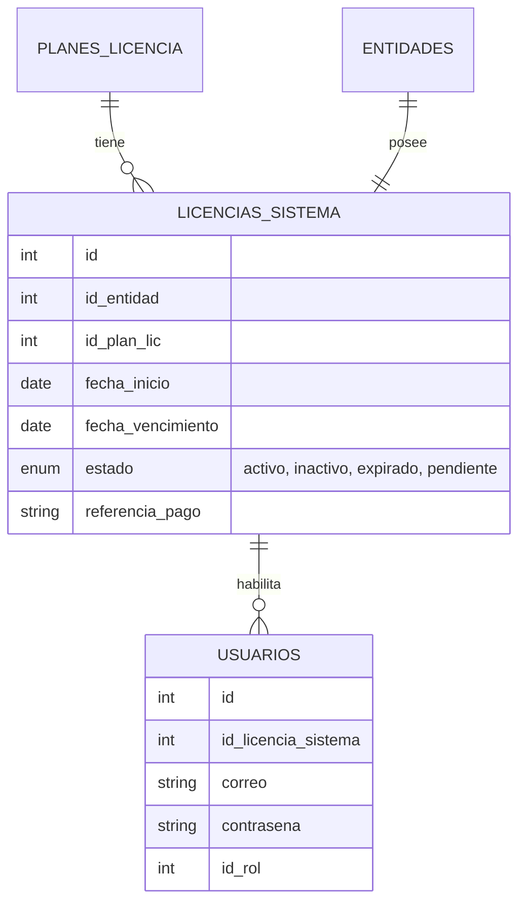
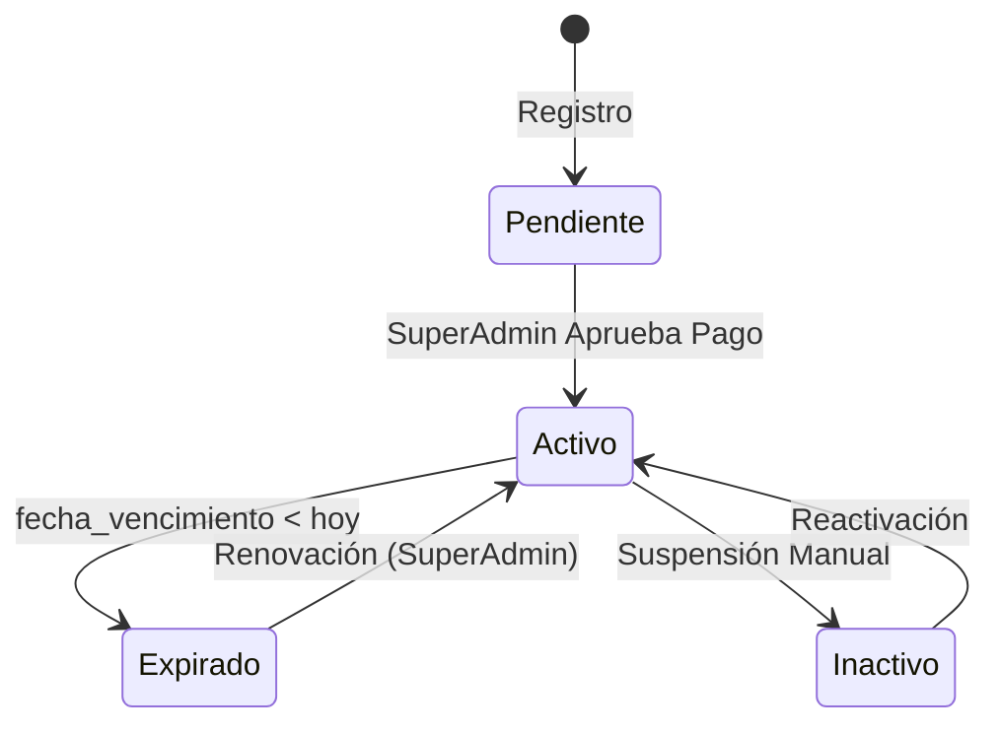

# Proyecto Entrada y Salida - Sistema de Gestión de Licencias

Este proyecto consiste en una aplicación web (React + Laravel) para la gestión de entidades, licencias y control de acceso.

## Arquitectura del Sistema

### Relaciones Clave
*   **Plan** (1) ---- (N) **Licencia**
*   **Entidad** (1) ---- (1) **Licencia**
*   **Licencia** (1) ---- (N) **Usuarios (Administradores)**

### Flujo de Registro Unificado
1.  **Selección de Plan**: El usuario elige un plan.
2.  **Datos de Entidad**: Se capturan los datos de la organización.
3.  **Datos de Administrador**: Se capturan los datos del usuario.
4.  **Transacción Única**: Se envían todos los datos al backend (`/api/registration/full`), creando:
    *   Entidad
    *   Licencia (Estado: Pendiente)
    *   Usuario Admin (Vinculado a la Licencia)

## Estados de Licencia
*   **Pendiente**: La licencia ha sido creada pero no pagada/validada. El usuario es redirigido a la pantalla de pago.
*   **Activo**: El usuario tiene acceso completo al Dashboard.
*   **Expirado**: La fecha de vencimiento ha pasado. El usuario ve un modal de bloqueo.
*   **Inactivo/Suspendido**: Acceso revocado por el SuperAdmin.

## Instalación y Ejecución

### Backend (Laravel)
```bash
cd backend
composer install
cp .env.example .env
php artisan key:generate
php artisan migrate --seed
php artisan serve
```

### Frontend (React)
```bash
cd frontend
npm install
npm run dev
```

## Diagramas (Mermaid)

### Modelo de Datos Simplificado


### Flujo de Estados

